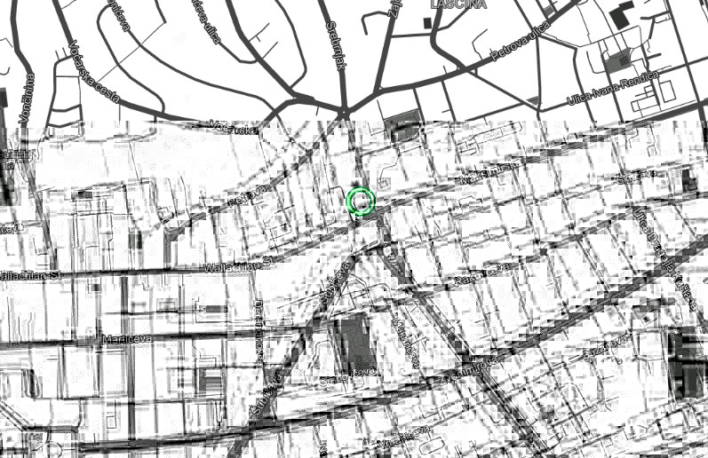

# Cursor-on-target adapter

connects to external cursor-on-target router,

provides pluggable parsers for COT

by default it broadcasts messages using embedded mqtt-over-websocket server
provides a light web server and clientside map view

