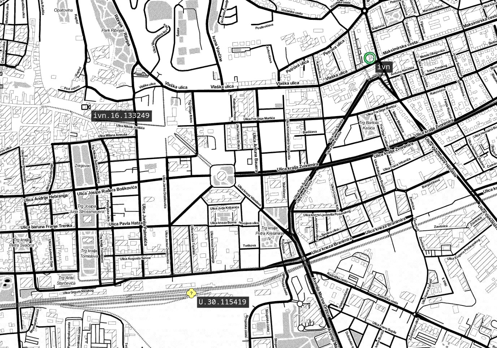

# Cursor-on-target adapter

connects to external cursor-on-target router,

provides pluggable parsers for COT, out of the box one translates COT to mqtt tree, and shows data via a web vies



# Running

```sh
git clone https://github.com/leshy/cotweb
cd cotweb
npm run buildall
```

create a new file, `config/development.json` and add mapbox api key there, might need to create an acc at mapbox.com

(config system is complex but I haven't documented it yet, this sort of depth makes sense trust me:)

```json
{
  "system": {
    "webServer": {
      "clientside": {
        "mapBoxKey": "pk.....your key"
      }
    }
  }
}
```

run the app

```sh
npm run start
```
